```mermaid
flowchart TD
    A[Input umur] --> B{0 < umur < 13?}
    B -->|Ya| E[Anak-anak]
    B -->|Tidak| C{13 ≤ umur < 18?}
    C -->|Ya| F[Remaja]
    C -->|Tidak| D{umur ≥ 18?}
    D -->|Ya| G[Dewasa]
    D -->|Tidak| H[Tidak Diketahui]
```

---

## 🔍 Operasi Perbandingan

Digunakan untuk membandingkan variabel dengan kondisi tertentu atau dengan variabel lain.

| Operator | Arti              | Contoh    | Hasil   |
| -------- | ----------------- | --------- | ------- |
| `==`     | Sama dengan       | `5 == 5`  | `True`  |
| `!=`     | Tidak sama dengan | `5 != 3`  | `True`  |
| `<`      | Lebih kecil       | `3 < 7`   | `True`  |
| `>`      | Lebih besar       | `10 > 7`  | `True`  |
| `<=`     | Lebih kecil/sama  | `5 <= 5`  | `True`  |
| `>=`     | Lebih besar/sama  | `8 >= 10` | `False` |

---

## 🌳 If-Else (Percabangan)

Struktur if-else digunakan untuk mengatur jalannya program berdasarkan kondisi tertentu.

```py title="if_else.py"
ipk = float(input("Masukan IPK : "))
if ipk >= 2:
    print("Lulus")
else:
    print("Tidak Lulus")
```

```py title="output"
Masukan IPK : 2.5
Lulus
```

### Diagram Alur If-Else


---

## 🪜 If-Elif-Else (Bertingkat)

Untuk banyak kondisi, gunakan `elif`.

```py title="if_elif_else.py"
umur = int(input("Masukan umur : "))
if 0 < umur < 13:
    print("Anak Anak")
elif 13 <= umur < 18:
    print("Remaja")
elif umur >= 18:
    print("Dewasa")
else:
    print("Tidak Diketahui")
```



```py title="output"
Masukan umur : 15
Remaja
```

---

## ⚠️ Pentingnya Urutan Kondisi

Urutan kondisi **mempengaruhi hasil**.

```py title="contoh_salah.py"
bilangan = int(input("Masukkan bilangan: "))
if bilangan > 10:
    print("Bilangan di atas 10")
elif bilangan == 10:
    print("Bilangan sama dengan 10")
elif bilangan < 10:
    print("Bilangan di antara 0 dan 10 (0 termasuk)")
# highlight-start
elif bilangan < 0:                    # Kondisi ini tidak akan pernah berjalan
    print("Bilangan di bawah 0")
# highlight-end
```


>➡️ Masalah: Kondisi bilangan < 0 tidak pernah tercapai karena sudah “tertangkap” di bilangan < 10.

```py title="output"
Masukkan bilangan: -5
Bilangan di antara 0 dan 10 (0 termasuk)   # ❌ salah, karena kondisi < 10 sudah terpenuhi lebih dulu
```

Versi benar:

```py title="contoh_benar.py"
bilangan = -5
if bilangan < 0:
    print("Bilangan di bawah 0")
elif bilangan < 10:
    print("Bilangan di antara 0 dan 10 (0 termasuk)")
elif bilangan == 10:
    print("Bilangan sama dengan 10")
elif bilangan > 10:
    print("Bilangan di atas 10")
```


```py title="output"
Masukkan bilangan: -5
Bilangan di bawah 0
```

---

## 🔗 Operasi Logika

Digunakan untuk menggabungkan ekspresi perbandingan.

| Operator | Arti             | Contoh                  |
| -------- | ---------------- | ----------------------- |
| `and`    | Konjungsi (dan)  | `(x > 0) and (x % 2 == 0)`  |
| `or`     | Disjungsi (atau) | `(umur < 13) or (umur >17)` |
| `not`    | Negasi (tidak)   | `not (x > 0)`             |

---

## 🧮 Tabel Kebenaran

AND (`and`)
| A     | B     | A and B |
|-------|-------|---------|
| True  | True  | True    |
| True  | False | False   |
| False | True  | False   |
| False | False | False   |

OR (`or`)
| A     | B     | A or B  |
|-------|-------|---------|
| True  | True  | True    |
| True  | False | True    |
| False | True  | True    |
| False | False | False   |

NOT (`not`)
| A     | not A  |
|-------|--------|
| True  | False  |
| False | True   |

---

### Contoh 1: Positif & Genap/Ganjil

```py title="logika_1.py"
bilangan = int(input("Masukan Bilangan : "))
if bilangan > 0 and bilangan % 2 == 0:
    print("Bilangan Genap Positif")
elif bilangan > 0 and bilangan % 2 == 1:
    print("Bilangan Ganjil Positif")
else:
    print("Bilangan Negatif")
```

```py title="output"
Masukan Bilangan : 7
Bilangan Ganjil Positif
```

### Contoh 2: Validasi Umur

```py title="logika_2.py"
umur = int(input("Masukan Umur : "))
if not umur >= 0:
    print("Umur Tidak Boleh Negatif")
elif umur < 13 or umur > 17:
    print("Beliau Bukan Remaja")
else:
    print("Beliau Adalah Remaja")
```

```py title="output"
Masukan Umur : -5
Umur Tidak Boleh Negatif
```
