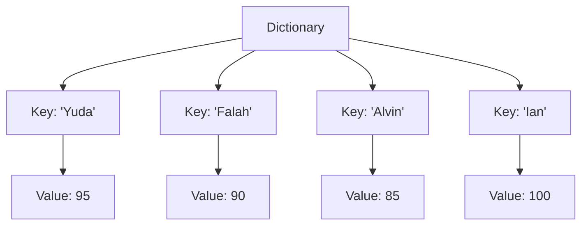

---

## 🧩 Dictionary dalam Python

Dictionary digunakan untuk menyimpan pasangan **key-value**, mirip seperti kamus: setiap kata (key) memiliki arti (value). Sangat berguna untuk data terstruktur.

---

### 🧠 Konsep Dasar

```py title="dictionary_dasar.py"
# Dictionary Kosong
nilai = {}

# Dictionary Berisi Data
nilai = {"Yuda": 95, "Falah": 90, "Alvin": 85, "Ian": 100}

print(nilai)
```

📘 **Penjelasan:**

* Key = label unik untuk tiap data
* Value = isi yang berasosiasi dengan key

💡 **Perbedaan dengan List:**

| Tipe | Cara Akses         | Contoh         |
| ---- | ------------------ | -------------- |
| List | Menggunakan indeks | `data[0]`      |
| Dict | Menggunakan key    | `data["Yuda"]` |

---

### 🎯 Akses Data

```py title="akses_data.py"
print(nilai["Falah"])
print(f"Nilai dari Alvin adalah {nilai['Alvin']}")
```

```py title="output"
90
Nilai dari Alvin adalah 85
```

---

### ⚠️ Key Harus Unik

Jika ada duplikasi key, Python hanya menyimpan value terakhir.

```py title="duplikat_key.py"
asprak = {"Daspem A": "Yuda", "Daspem A": "Falah"}
print(asprak)
```

```py title="output"
{'Daspem A': 'Falah'}
```

✅ **Solusi Benar:**

```py title="asprak_benar.py"
asprak = {
    "Daspem A1": "Yuda",
    "Daspem A2": "Falah",
    "Daspem B1": "Alvin",
    "Daspem B2": "Ian"
}
print(asprak)
```

---

### 🧱 Operasi Dasar Dictionary

#### ➕ Menambah Elemen

```py title="tambah_elemen.py"
asprak["Daspem C1"] = "Deskafim"
print(asprak)
```

#### 🔁 Mengubah Elemen

```py title="ubah_elemen.py"
asprak["Daspem C1"] = "deskafim.code"
print(asprak)
```

#### ❌ Menghapus Elemen

```py title="hapus_elemen.py"
del asprak["Daspem C1"]
print(asprak)
```

---

### 🔍 Melihat Key, Value, dan Item

```py title="lihat_data.py"
print(asprak.keys())
print(asprak.values())
print(asprak.items())
```

```py title="output"
dict_keys(['Daspem A1', 'Daspem A2', 'Daspem B1', 'Daspem B2'])
dict_values(['Yuda', 'Falah', 'Alvin', 'Ian'])
dict_items([('Daspem A1', 'Yuda'), ('Daspem A2', 'Falah'), ('Daspem B1', 'Alvin'), ('Daspem B2', 'Ian')])
```

---

### 📊 Fungsi Umum yang Berlaku untuk Dictionary

| Fungsi  | Kegunaan                         | Catatan                                                     |
| ------- | -------------------------------- | ----------------------------------------------------------- |
| `len()` | Menghitung jumlah key            | Berlaku untuk semua dictionary                              |
| `sum()` | Menjumlahkan semua value numerik | Pastikan semua value bertipe angka                          |
| `max()` | Key terbesar (secara urutan)     | Jika value ingin dibandingkan, gunakan `max(dict.values())` |
| `min()` | Key terkecil                     | Sama seperti `max()`                                        |

```py title="fungsi_dictionary.py"
nilai = {"Yuda": 95, "Falah": 90, "Alvin": 85, "Ian": 100}
print(len(nilai))
print(sum(nilai.values()))
print(max(nilai.values()))
print(min(nilai.values()))
```

```py title="output"
4
370
100
85
```

---

### 💡 Catatan Penting

* Key harus **immutable** (string, int, tuple, dll). Tidak boleh list atau dict.
* Value bisa bertipe apa saja (int, list, dict, dll).
* Dictionary sangat efisien untuk **pencarian dan pemetaan data.**

---

### 🎓 Bonus: Ilustrasi Struktur Dictionary



---

> 📘 **Kesimpulan:**
> Dictionary = Struktur data asosiatif (key → value).
> Cocok untuk menyimpan data terlabel seperti *nilai mahasiswa*, *biodata*, atau *konfigurasi aplikasi*.
