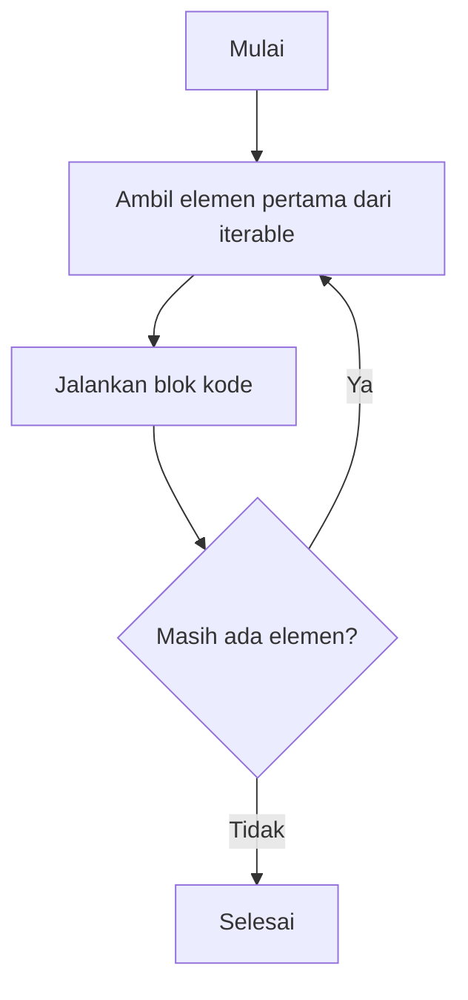

---

## 🔁 For Loop dalam Python

`for` loop digunakan untuk **mengulang elemen** dari *iterable object* (seperti list, tuple, string, atau dictionary). Berbeda dengan `while`, jumlah iterasi biasanya **sudah diketahui**.

---

### 🧠 Konsep Dasar

```py title="for_dasar.py"
mahasiswa = ["Yuda", "Falah", "Alvin", "Ian"]

for nama in mahasiswa:
    print(nama)
```

```py title="output"
Yuda
Falah
Alvin
Ian
```

📘 **Penjelasan:**

* `mahasiswa` adalah *iterable* (dapat diulang)
* `nama` akan mengambil setiap elemen dari list secara berurutan

---

### ⚙️ Struktur Umum

```py
for variabel in iterable:
    # blok kode
else:
    # (opsional) dijalankan jika loop selesai tanpa break
```

💡 **Catatan:** `else` pada `for` hanya dieksekusi jika loop selesai tanpa `break`.

---

### 🎯 Contoh: Menggunakan `range()`

```py title="for_range.py"
for i in range(5):
    print(i)
```

```py title="output"
0
1
2
3
4
```

📘 **Penjelasan:**
`range(5)` menghasilkan deretan angka dari **0 hingga 4**.

Kita bisa menyesuaikan:

```py
range(start, stop, step)
```

Contoh:

```py title="for_range_custom.py"
for i in range(1, 10, 2):
    print(i)
```

```py title="output"
1
3
5
7
9
```

---

### 🔁 Perulangan pada String

```py title="for_string.py"
for huruf in "Python":
    print(huruf)
```

```py title="output"
P
y
t
h
o
n
```

---

### 🧱 Perulangan pada Dictionary

```py title="for_dictionary.py"
nilai = {"Yuda": 95, "Falah": 90, "Alvin": 85}

for nama, skor in nilai.items():
    print(f"{nama} mendapatkan nilai {skor}")
```

```py title="output"
Yuda mendapatkan nilai 95
Falah mendapatkan nilai 90
Alvin mendapatkan nilai 85
```

📘 **Penjelasan:**
`dict.items()` mengembalikan pasangan `(key, value)` untuk diakses secara bersamaan.

---

### ⛔ Menghentikan dan Melewati Iterasi

```py title="for_break_continue.py"
for i in range(1, 6):
    if i == 3:
        continue  # lewati angka 3
    if i == 5:
        break      # berhenti di angka 5
    print(i)
```

```py title="output"
1
2
4
```

---

### 🔄 Nested Loop (Perulangan Bersarang)

```py title="nested_for.py"
for i in range(1, 4):
    for j in range(1, 4):
        print(f"i={i}, j={j}")
```

```py title="output"
i=1, j=1
i=1, j=2
i=1, j=3
i=2, j=1
i=2, j=2
i=2, j=3
i=3, j=1
i=3, j=2
i=3, j=3
```

📘 **Penjelasan:**
Setiap iterasi `i` menjalankan seluruh iterasi `j` → total 9 kombinasi.

---

### 💡 Kombinasi `for` + `enumerate()`

```py title="for_enumerate.py"
mahasiswa = ["Yuda", "Falah", "Alvin", "Ian"]

for index, nama in enumerate(mahasiswa, start=1):
    print(f"{index}. {nama}")
```

```py title="output"
1. Yuda
2. Falah
3. Alvin
4. Ian
```

📘 **Penjelasan:**
`enumerate()` memberi indeks otomatis pada setiap elemen list.

---

### 🧩 Bonus: Ilustrasi Alur For Loop



---

### 📘 Kesimpulan

> `for` loop = perulangan berbasis koleksi/urutan.
>
> Cocok untuk mengakses elemen list, tuple, string, atau dictionary secara sistematis.
>
> Gunakan `for` jika jumlah iterasi **diketahui atau terikat pada panjang data**.

