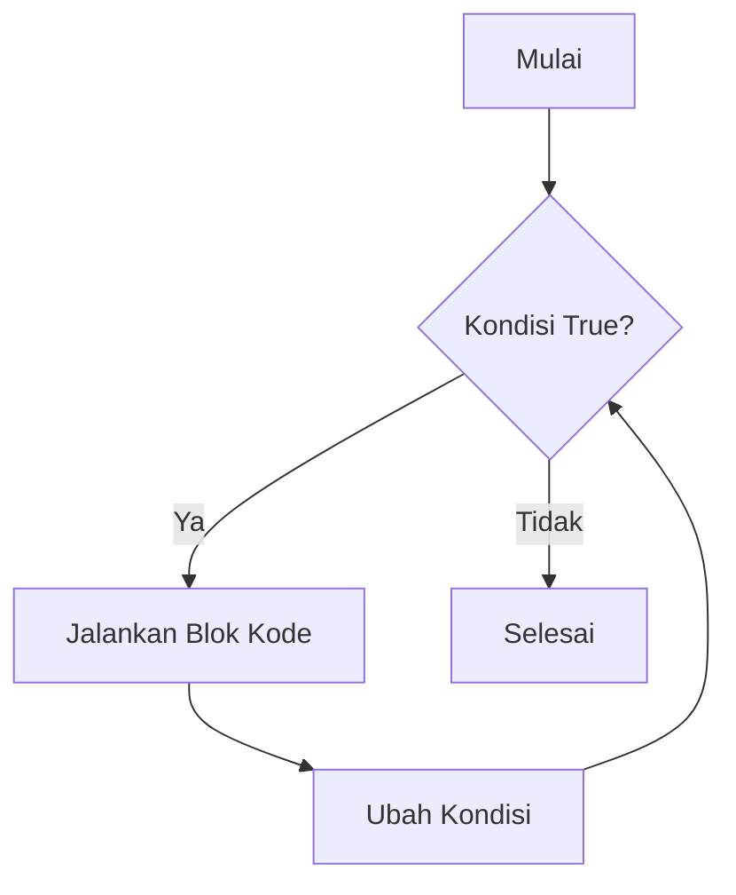

---

## 🔁 While Loop dalam Python

`while` loop digunakan untuk menjalankan blok kode **selama kondisi bernilai True**. Cocok untuk kasus di mana jumlah perulangan **tidak diketahui secara pasti**.

---

### 🧠 Konsep Dasar

```py title="while_dasar.py"
i = 1
while i <= 5:
    print(i)
    i += 1
```

```py title="output"
1
2
3
4
5
```

📘 **Penjelasan:**

* `while i <= 5` → kondisi perulangan
* `i += 1` → memastikan loop akan berhenti
* Tanpa kenaikan nilai `i`, program akan **berjalan selamanya (infinite loop)** ⚠️

---

### ⚙️ Struktur Umum

```py
while kondisi:
    # blok kode yang dijalankan jika kondisi True
else:
    # (opsional) dijalankan ketika kondisi False
```

💡 **`else` dalam while** akan dijalankan ketika loop selesai secara normal (tidak dipaksa berhenti dengan `break`).

---

### 🎯 Contoh: Perulangan dengan Batasan

```py title="while_dengan_batas.py"
i = 1
while i <= 3:
    print(f"Perulangan ke-{i}")
    i += 1
else:
    print("Loop selesai!")
```

```py title="output"
Perulangan ke-1
Perulangan ke-2
Perulangan ke-3
Loop selesai!
```

---

### ⛔ Menghentikan Loop dengan `break`

```py title="while_break.py"
i = 1
while i <= 10:
    print(i)
    if i == 5:
        print("Berhenti di 5!")
        break
    i += 1
```

```py title="output"
1
2
3
4
5
Berhenti di 5!
```

📘 **Penjelasan:**
`break` langsung menghentikan loop meskipun kondisi `while` masih `True`.

---

### 🔁 Melewati Iterasi dengan `continue`

```py title="while_continue.py"
i = 0
while i < 5:
    i += 1
    if i == 3:
        continue
    print(i)
```

```py title="output"
1
2
4
5
```

📘 **Penjelasan:**
Ketika `i == 3`, program **melewati** `print(i)` dan lanjut ke iterasi berikutnya.

---

### 📊 Contoh Nyata: Validasi Input

```py title="validasi_input.py"
password = "python123"
input_user = ""

while input_user != password:
    input_user = input("Masukkan password: ")
    if input_user == password:
        print("✅ Akses diterima!")
    else:
        print("❌ Password salah, coba lagi!")
```

📘 **Penjelasan:**
Loop akan terus berjalan **selama input tidak cocok dengan password**.

---

### 💡 Catatan Penting

* Gunakan **`while`** ketika jumlah iterasi tidak pasti.
* Pastikan kondisi **akan berubah menjadi False** untuk menghindari *infinite loop*.
* Kombinasikan `break` dan `continue` untuk kontrol yang lebih fleksibel.

---

### 🧩 Bonus: Ilustrasi Alur While Loop



---

> 📘 **Kesimpulan:**
> `while` loop = perulangan berbasis kondisi.
> Cocok untuk validasi input, menunggu event, atau proses berulang yang belum diketahui jumlahnya.

