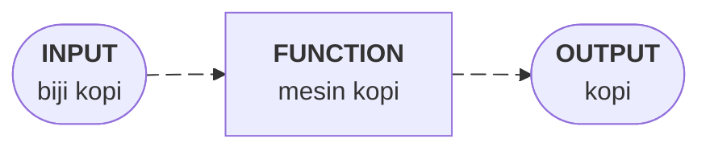

---

id: materiFunction
title: Python Function
sidebar_label: Python Function
sidebar_position: 1

---

---

## 📚 Apa itu Function?

**Function** (fungsi) adalah blok kode yang dapat digunakan kembali untuk melakukan tugas tertentu. Bayangkan function seperti *mesin kopi* - kamu memberikan input (biji kopi), mesin memproses, dan menghasilkan output (kopi yang siap diminum). Dalam data science, function sangat penting untuk membuat kode yang rapi, mudah dipelihara, dan efisien.



### 💡 Mengapa Function Penting dalam Data Science?

- Menghindari pengulangan kode (DRY - Don't Repeat Yourself)
- Membuat kode lebih mudah dibaca dan dipahami
- Memudahkan testing dan debugging
- Meningkatkan efisiensi workflow analisis data

---

## 🔧 Syntax Dasar Function

Struktur dasar pembuatan function di Python menggunakan keyword `def`:

```python
def nama_function(parameter1, parameter2):
    """Docstring: penjelasan tentang function"""
    # Kode yang akan dijalankan
    hasil = parameter1 + parameter2
    return hasil
```

### Contoh Sederhana:

```python
# Function untuk menghitung rata-rata
def hitung_rata_rata(angka_list):
    """Menghitung rata-rata dari list angka"""
    total = sum(angka_list)
    jumlah = len(angka_list)
    rata_rata = total / jumlah
    return rata_rata

# Menggunakan function
nilai_mahasiswa = [85, 90, 78, 92, 88]
hasil = hitung_rata_rata(nilai_mahasiswa)
print(f"Rata-rata nilai: {hasil}")  # Output: 86.6
```

---

## 📥 Parameter dan Argument

### 1. Positional Arguments

Argument diberikan berdasarkan urutan parameter:

```python
def perkenalan(nama, umur, jurusan):
    return f"Halo, saya {nama}, umur {umur}, jurusan {jurusan}"

print(perkenalan("Budi", 20, "Data Science"))
# Output: Halo, saya Budi, umur 20, jurusan Data Science
```

### 2. Keyword Arguments

Argument diberikan dengan menyebutkan nama parameter:

```python
print(perkenalan(jurusan="Data Science", nama="Ani", umur=21))
# Urutan tidak masalah karena kita menyebutkan nama parameter
```

### 3. Default Parameters

Parameter dengan nilai default jika tidak diberikan:

```python
def hitung_diskon(harga, diskon=0.1):
    """Menghitung harga setelah diskon (default 10%)"""
    harga_akhir = harga - (harga * diskon)
    return harga_akhir

print(hitung_diskon(100000))        # Diskon 10%: 90000
print(hitung_diskon(100000, 0.25))  # Diskon 25%: 75000
```

---

## 📊 Contoh Function untuk Sains Data

### Normalisasi Data

```python
def normalisasi_min_max(data):
    """
    Normalisasi data ke rentang 0-1
    Formula: (x - min) / (max - min)
    """
    min_val = min(data)
    max_val = max(data)
    normalized = [(x - min_val) / (max_val - min_val) for x in data]
    return normalized

# Contoh penggunaan
data_asli = [10, 20, 30, 40, 50]
data_normal = normalisasi_min_max(data_asli)
print(data_normal)  # [0.0, 0.25, 0.5, 0.75, 1.0]
```

### Deteksi Outlier Sederhana

```python
def deteksi_outlier(data, threshold=1.5):
    """
    Deteksi outlier menggunakan IQR method
    """
    sorted_data = sorted(data)
    n = len(sorted_data)
    
    q1 = sorted_data[n // 4]
    q3 = sorted_data[3 * n // 4]
    iqr = q3 - q1
    
    lower_bound = q1 - threshold * iqr
    upper_bound = q3 + threshold * iqr
    
    outliers = [x for x in data if x < lower_bound or x > upper_bound]
    return outliers

# Contoh penggunaan
nilai = [85, 90, 88, 92, 87, 150, 89, 91]  # 150 adalah outlier
print(deteksi_outlier(nilai))  # [150]
```

---

## ⚡ Lambda Functions (Anonymous Functions)

Lambda function adalah function kecil tanpa nama, biasa digunakan untuk operasi sederhana:

```python
# Function biasa
def kuadrat(x):
    return x ** 2

# Lambda function (sama dengan function di atas)
kuadrat_lambda = lambda x: x ** 2

print(kuadrat(5))         # 25
print(kuadrat_lambda(5))  # 25

# Penggunaan dengan map, filter
angka = [1, 2, 3, 4, 5]
hasil_kuadrat = list(map(lambda x: x ** 2, angka))
print(hasil_kuadrat)  # [1, 4, 9, 16, 25]

# Filter angka genap
genap = list(filter(lambda x: x % 2 == 0, angka))
print(genap)  # [2, 4]
```

---

*Jangan ragu untuk bereksperimen dengan kode dan membuat function sendiri!*
