---

id: materiRecursiveFunction
title: Python Recursive Function
sidebar_label: Python Recursive Function
sidebar_position: 2

---

---

## 🔄 Function Rekursif

**Function rekursif** adalah function yang memanggil dirinya sendiri. Bayangkan seperti cermin yang saling berhadapan, menciptakan refleksi tak terbatas - namun dalam pemrograman, kita harus memberikan titik berhenti. Function rekursif sangat berguna untuk masalah yang dapat dipecah menjadi versi lebih kecil dari masalah yang sama.

> ⚠️ **Penting!** Function rekursif harus memiliki **base case** (kondisi berhenti), jika tidak akan terjadi infinite loop!

### Struktur Function Rekursif:

```python
def function_rekursif(parameter):
    # BASE CASE - kondisi berhenti (penting!)
    if kondisi_berhenti:
        return nilai_dasar
    
    # RECURSIVE CASE - memanggil diri sendiri dengan parameter lebih sederhana
    else:
        return function_rekursif(parameter_lebih_kecil)
```

### Contoh 1: Menghitung Pangkat

Menghitung x pangkat n (x^n) secara rekursif:

```python
def pangkat(x, n):
    """
    Menghitung x pangkat n secara rekursif
    Contoh: 2^3 = 2 × 2 × 2 = 8
    """
    # Base case: angka pangkat 0 = 1
    if n == 0:
        return 1
    
    # Recursive case: x^n = x × x^(n-1)
    else:
        return x * pangkat(x, n - 1)

# Penggunaan
print(pangkat(2, 3))   # 8
print(pangkat(5, 2))   # 25
print(pangkat(10, 0))  # 1
```

Visualisasi proses:

```mermaid
graph TD
  A["<span style="color:#FF5533">pangkat(2, 3)</span>"] --> B["2 × <span style="color:#FF5533">pangkat(2, 2)</span>"]
  B --> C["2 × 2 × <span style="color:#FF5533">pangkat(2, 1)</span>"]
  C --> D["2 × 2 × 2 × <span style="color:#FF5533">pangkat(2, 0)</span>"]
  D --> E["2 × 2 × 2 × 1"]
  E --> F["8"]
```


### Contoh 2: Membalik String

Membalik urutan karakter dalam string:

```python
def balik_string(text):
    """
    Membalik string secara rekursif
    'data' menjadi 'atad'
    """
    # Base case: string kosong atau 1 karakter
    if len(text) <= 1:
        return text
    
    # Recursive case: ambil karakter terakhir + balik sisanya
    else:
        return text[-1] + balik_string(text[:-1])

# Penggunaan
print(balik_string("data"))       # "atad"
print(balik_string("python"))     # "nohtyp"
print(balik_string("rekursif"))   # "fisruker"

```

Visualisasi proses untuk "data":

---

### Rekursif vs Iteratif: Kapan Menggunakan Apa?

```python
# Contoh: Menghitung panjang list

# REKURSIF - elegan untuk masalah yang bersifat rekursif
def panjang_rekursif(lst):
    if len(lst) == 0:
        return 0
    return 1 + panjang_rekursif(lst[1:])

# ITERATIF - lebih efisien untuk kasus sederhana
def panjang_iteratif(lst):
    count = 0
    for _ in lst:
        count += 1
    return count

data = [1, 2, 3, 4, 5]
print(panjang_rekursif(data))   # 5
print(panjang_iteratif(data))   # 5
```

> ⚠️ **Perhatian:** Rekursif yang terlalu dalam bisa menyebabkan `RecursionError: maximum recursion depth exceeded`. Python default limit adalah sekitar 1000 level rekursi.

---

*Panduan ini dibuat untuk mahasiswa sains data yang baru belajar coding. Jangan ragu untuk bereksperimen dengan kode dan membuat function sendiri!*
